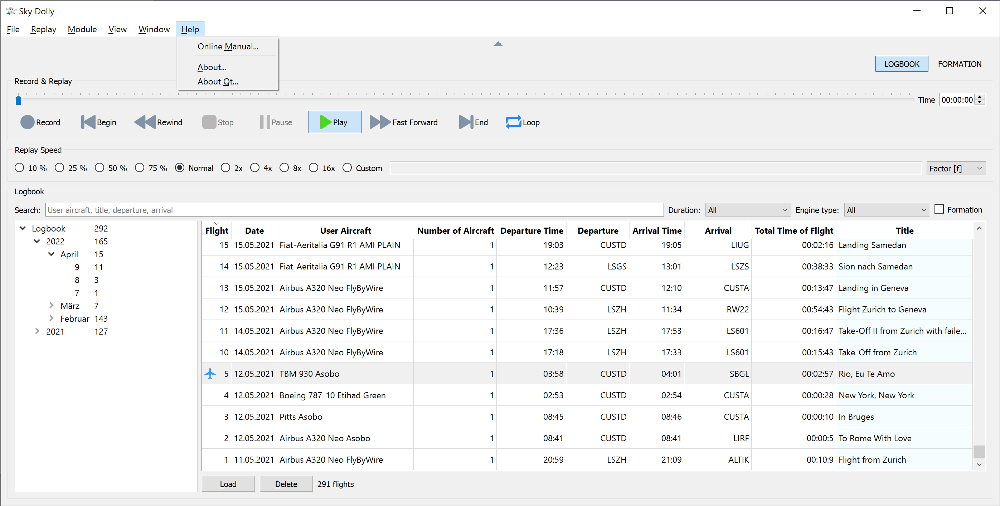

# Introduction

[Index](index.md) \| [Introduction](intro.md)

## Sky Dolly
Sky Dolly is a flight recorder application which stores the *simulation variables* of flights recorded for instance in Microsoft Flight Simulator, henceforward simply referred to as the *flight simulator*.

## Recording & Replay
The Sky Dolly application runs next to the *flight simulator* and communicates via the SimConnect API, a standard API to retrieve and set the internal simulation state. The state is retrieved and set via *simulation varibles*, for instance:

- Aircraft
  * Position (latitude, longitude, altitude)
  * Velocity
  * Acceleration
- Engine
  * Thrust
  * Mixture
- Primary controls
  * Rudder
  * Elevator
  * Aileron

To name a few. Upon replay those simulation variables are then sent back to the *flight simulator* which on its turn the recreates the previously recorded flight.

## Logbook
Sky Dolly automatically stores each recorded *flight* in its *logbook*. No need to save and load separate files. In fact, the *logbook* is based on a database (an SQLite file-based database, to be specific) which allows to easily search and filter the recorded *flights*, by criteria such as the engine type (for instance jet, piston or turboprop), recording date, flight duration or destination (or even a combination thereof).

*Logbook* entries are called a *flight*. Each *flight* stores:

- Initial flight conditions such as visibility, pitot icing and temperature (for information purposes)
- Optional title and description
- Start of recording timestamp (real-world time)
- Start of flight (simulation time, both local and zulu times)

The following chart illustrates the flow of simulation variables:

graph LR;
  FS([Flight Simulator]);
  SD([Sky Dolly]);
  LB([Logbook]);
  FS --> |Record| SD;
  SD --> |Replay| FS;
  SD --> |Store| LB;
  LB --> |Restore| SD;

## Formation Flights
Each *flight* has at least one recorded *aircraft*. However a flight may have *multiple* recorded aircraft which are then replayed all together - a *formation* flight.

In fact, Sky Dolly will replay all previously recorded aircraft while recording the current aircraft. Only this feature makes it possible to know the relative position of the aircraft being recorded - also called the *user aircraft* - in relation to the other aircraft in the formation.

The time offset for each aircraft can be adjusted as well. This is useful when formation flights on multiple computers are recorded at the same time and then combined in a single *formation*, by means of import & export plugins (see below). The time offset then compensates the fact that not every pilot pressed the *record* button at the exact same time.

## Modules
Sky Dolly organises its functionality in *modules*. Currently the following *modules* are implemented:

### Logbook
This is the main module which gives access to all recorded *flights*. Recording an aircraft will automatically create and store a new *flight*.

### Formation
Manages the aircraft within a formation *flight* and allows to specify the initial relative position of the next recorded aircraft, relative to the current *user aircraft* in the formation.

When the *record* button is pressed then the current recorded aircraft is *added* to the *existing flight*.

## Import & Export
Various file formats are supported to exchange data with other applications. Currently the following formats are supported:

- CSV (import and export, various flavours inlcuding CSV data from flightradar24.com)
- GPX (import and export)
- IGC (import and export)
- JSON (export in GeoJSON format)
- KML (import and export, various flavours including KML files from flightaware.com and flightradar24.com)

[Index](index.md) \| [Introduction](intro.md)